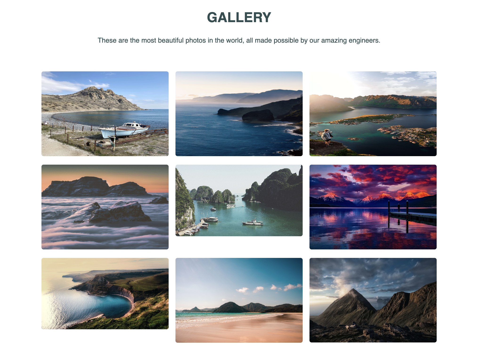
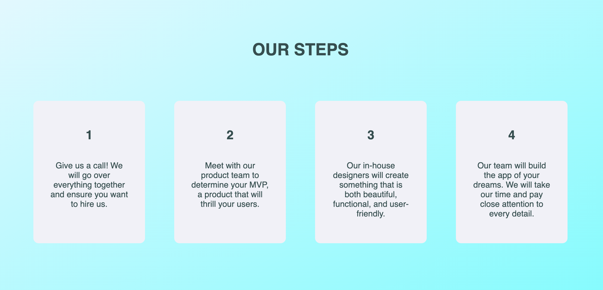
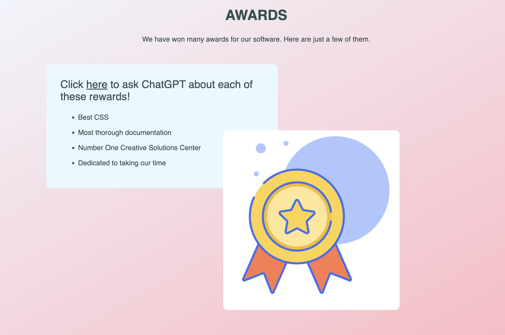

# In-class assignment instructions
# Headers section PART ONE (headers)

1. Read these instructions at least once before you begin
2. Navigate to html-in-class-instructor/index.html
3. Take 10 minutes to look over the code. It's ok if it doesn't make sense yet.
4. Find the <section> tag that has a class attribute with a value of "headers-section"
5. Add 6 headers, from h1 to h6, inside the <section> tag. The text that is rendered to the screen should reflect the tag that is wrapped around it. So the h1 should let the user know "this is an h1", h2 renders "this is an h2", and so on
6. To see your code, right-click your html file and click on 'open with live server'.
7. STOP and head back to class

# Headers section PART TWO (anchor tags)
1. Read these instructions at least once before you begin
2. Turn each one of your headers into a hyperlink using the  tag.
3. For h1-h3, link just one word. When the user clicks the link, it should take them to your github profile
4. For h4-h6, link more than one word to Google's home page.
5. Google "attribute to open link in new browser tab HTML"
6. Add an attribute to your h1 that will open the link in a new browser tab
7. See what happens when you click the link in the browser!
8. STOP and head back to class

# Footer (buttons)
1. Read these instructions at least once before you begin
2. Find the footer section in the HTML
3. Add your code inside of the div with a class of "buttons-wrapper"
4. Add four buttons, each with a class attribute with a value of "button"
   a. Contact
   b. Learn
   c. Request
   d. Donate
5. Check out your code in the browser!
6. STOP and head back to class

# Gallery Section (images)
1. Read these instructions at least once before you begin
2. Navigate to the Gallery Section of the HTML
3. Inside the gallery-text-wrapper div, add your h1 and paragraph to match the design below
4. Find the images-wrapper div
5. Add all nine gallery images using relative paths
6. Add meaningful alt tags to each image
7. This is what your page should look like:
   
8. STOP and head back to class

# NAVBAR (unordered list, image)

1. Read these instructions at least once before you begin
2. Look for the <nav></nav> section in the html
   a. All of your code will go between the opening and closing nav tags
3. Look in your assets folder and see there is a file there called ac-logo.png
4. Back in your HTML, under the opening <nav> tag, add the logo to the navbar
   a. add a **class attribute** with a value of "nav-logo" to the image tag
   b. Add an alt tag
5. Create an **unordered list** with three list items.
   a. HOME
   b. ABOUT
   c. CONTACT
6. To see your code, right-click your html file and click on 'open with live server'. Make sure to refresh the page after making changes.
5. Move on to the next section, Our Certification Process

# Our certification process (ordered list)
1. Read these instructions at least once before you begin
2. Find the section with a class of "certification-section"
3. Below the header that says **Our Certification Process**, create an ordered list with four list items:
   a. Internal testing
   b. Beta testing with a small group
   c. Make changes based on feedback
   d. Present the software to the world!
4. Check out your code in the browser
5. STOP and head back to class

# Divs 
1. Read these instructions at least once before you begin
2. Find the <section> with a class attribute that has a value of "parent-child-section"
3. Write your code between the 

 tags.
4. Add a div with a class of "steps-card"
5. Inside of that div, use an h1 tag to put a **1** on the screen
6. After the h1, add a paragraph with the following text: "Give us a call! We will go over everything together and ensure you want to hire us."
7. Take a look in the browser!
8. The h1 and the paragraph should be **siblings**. Their **parent** is the steps-wrapper div
9. Make three more divs that have identical structure; look in the browser as you go
10. For the second div, change the h1 so it renders a 2, and change the paragraph to say: "Meet with our product team to determine your MVP, a product that will thrill your users."
11. For the third div, change the h1 so it renders a 3, and change the paragraph to say: "Our in-house designers will create something that is both beautiful, functional, and user-friendly."
12. For the fourth div, change the h1 so it renders a 4, and change the paragraph to say: "Our team will build the app of your dreams. We will take our time and pay close attention to every detail."
13. This is what your page should look like:
    
14. STOP and head back to class

# Awards section (practice)
1. Read these instructions at least once before you begin
2. Check out the design below
3. What elements do you see in the design?
4. Look at the HTML for the <secion> with a class of "awards-section"
5. Where in the HTML will the h1 and the paragraph go for the top?
   1. Add a class of "section-header" to the h1
   2. Add a class of "awards-section-text" to the p tag
6. Which content do you think goes inside the divs, based on their class names?
7. Re-create the design on your own!
   

# HERO SECTION (h1, p, button, form)

1. Read these instructions at least once before you begin
2. Find the section with a class of "hero-section"
3. Create a div with a class of "hero-wrapper"
4. Inside of the "hero-wrapper div, create a div with a class of "text-wrapper"
5. Inside of the text-wrapper div, add an h1 tag with a class of "hero-header". Add the text from the design.
6. Add a p tag that is a SIBLING to the h1 with the text from the design.
7. Add a button tag that is a sibling to the p tag abd the h1 with the text from the design.
8. Link the button to AnnieCannons.com
9. Create a div with a class of "form-wrapper" that is a CHILD of the "hero-wrapper" div and a sibling of the "text-wrapper" div
10. Add an h1 tag with the text from the design that is a child of the "form-wrapper" div
11. Create your from. Follow the designs.
    a) each input tag should have the following attributes: type, id, name, required, placeholder
    b) the select tag should have the following attributes: id, name, required
    i. the **first** option tag should have the following attributes: value, disabled, selected
    ii. the second and third option tags should have the following attributes: value
    c) the submit input tag should have the following attributes: type, value
