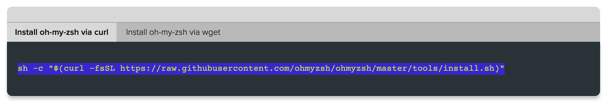

# Slide Deck

# Videos from slides
  - [50 macOS Tips and Tricks Using Terminal](https://www.youtube.com/watch?v=qOrlYzqXPa8)
  - [Udemy course on the terminal and command line](https://anniecannons.udemy.com/course/git-github-practical-guide/learn/lecture/27550942?isDefaultPlaying=#overview)

# Articles from slides
 - [Command Line Cheat Sheet](https://github.com/0nn0/terminal-mac-cheatsheet)

# In-class activities
**Google Search Activity**
- Google a specific terminal command
- Find a basic video tutorial on the command line for beginners. 
  - How many people have watched?
  - How long is the video?
  - What date was it posted?
- Find a command line cheat sheet

# Action Items

**Install OhMyZsh**
 - Open your terminal (Google 'open terminal mac')
 - Click [here](https://ohmyz.sh/#install) to open your browser and go to Install OhMyZsh
 - Click the button that says 'Install OhMyZsh'
 - Copy the code for installing via curl:
 

 **Terminal vs Finder**

